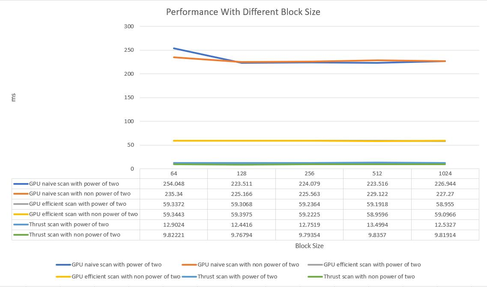
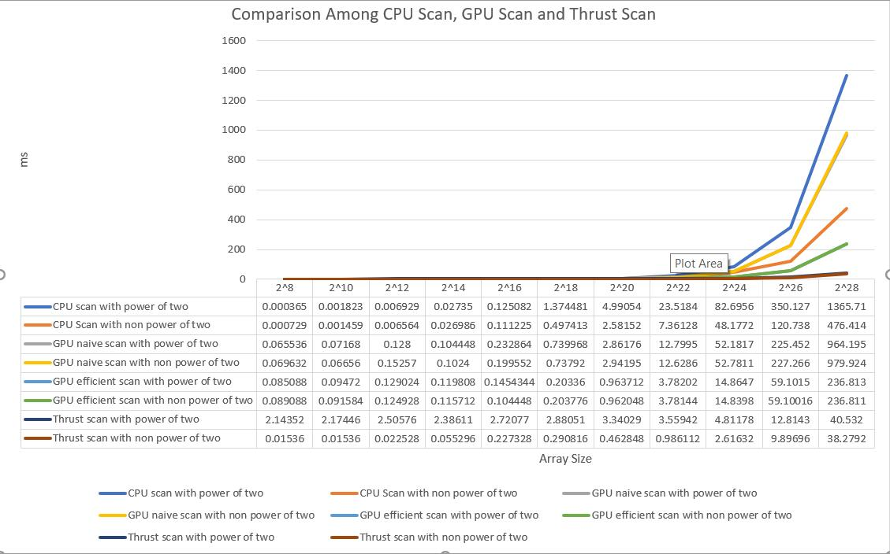
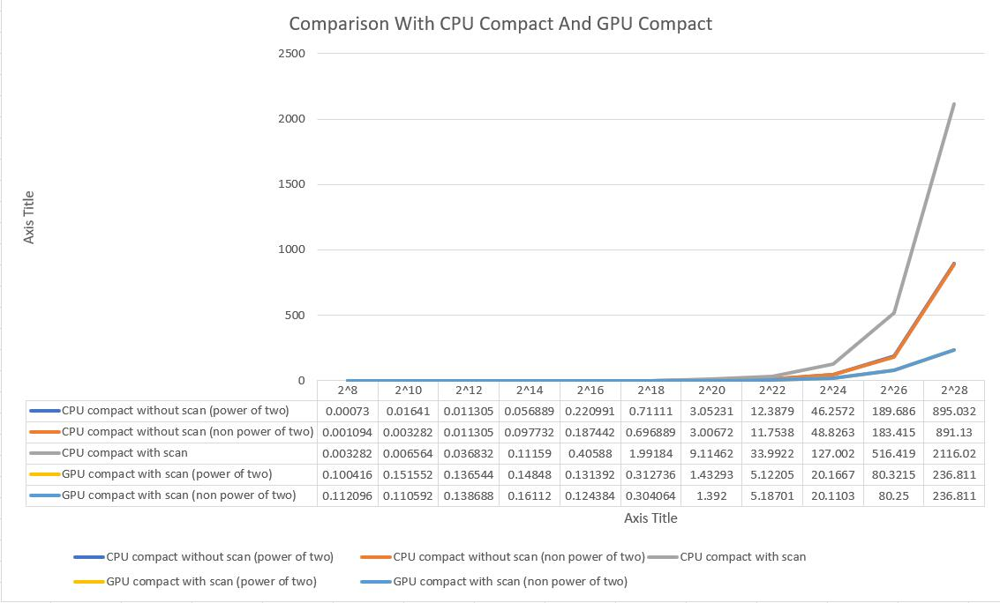
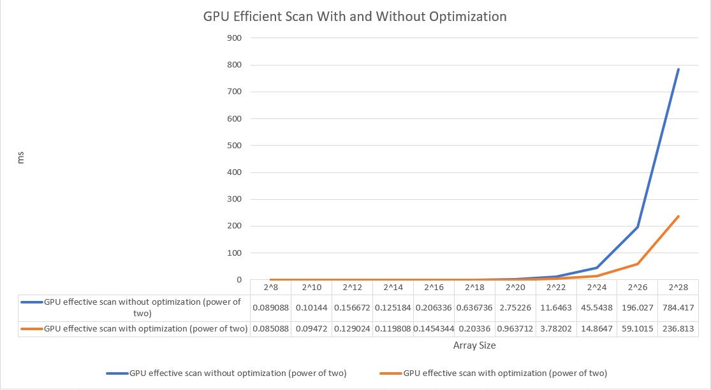

CUDA Stream Compaction
======================

**University of Pennsylvania, CIS 565: GPU Programming and Architecture, Project 2**

* Yuru Wang
  * yuruwang@seas.upenn.edu
* Tested on: Windows 10, i7-7700HQ @ 2.5GHz 128GB, GTX 1050 Ti 8GB (personal computer)
* Modified CMakeList.txt: changed sm_20 to sm_61 inside cuda_add_library

## Project Description ##
This project aims at implementing GPU stream compaction algorithm in CUDA. In this project, the compaction algorithm simply removes all zeros from an array of int s. To compare and analyze the performance of GPU and CPU computation, a few different versions of Scan (Prefix Sum) algorithms are implemented. Then they are used in the scatter algorithm to do stream compaction.

A list of features included in this project is as follows:
* CPU Scan: single for loop implementation
* CPU Stream Compaction: single for loop implementation
* Naive GPU Scan: GPU version of naive parallel reduction
* Work-Efficient GPU Scan: GPU version of work efficient parallel reduction with up sweep and down sweep phases
* Work-Efficient GPU Stream Compaction: GPU work efficient scan algorithm along with scatter algorithm
* Thrust's Implementation: using built-in thrust::exclusive_scan function

Extra Credit:
Part 5 (Optimize GPU work efficient scan) was implemented. The optimized efficient scan algorithm has obvious better performance than old one. The detail analysis and performance comparison are described at Next section.

## Performance Analysis and Questions ##

As shown in above diagram, the block size does not affect the performance much, so a decent block size of 512 was chosen for comparing performance of various implementations.



The above plot demonstrates a rough ranking among various versions of implementations: Thrust has best performance, and GPU work efficient scan algorithm comes next. The GPU naive scan algorithm ranks the third place, and the CPU scan performs worst.

When the array size is small (less than 2^20), there is no big performance difference between those implementations and we can even observe that CPU scan has best performance. I guess this is probably because GPU parallel computation would have more overhead than CPU when the array is too small. While the array size is getting larger, performances start diverging. GPU Efficient scan starts working better than CPU scan since the advantage of parallel computing exceeds its overhead.

Thrust implementation works very well even for large array size, I guess that is because thrust implementation uses shared memory, which results in faster memory access compare to global memory.



From this graph, it is clear that the GPU compact with scan has best performance than other implementations.



Above graph shows the performance improvement for the GPU work efficient scan after optimizing. About more than twice scan efficiency improvement can be observed especially for large array size that exceeds 2^26. This is achieved by decreasing hanging threads at up sweep and down sweep phases. The old implementation is slow because some threads are not working at each iteration of sweeping, which wastes the resources of SM. After decreasing removing those threads and compacting all working threads with indices hacks, the computing power of SM is fully used and the performance is thus improved.

## Output ##
blockSize = 512, ArraySize = 2^26

```
****************
** SCAN TESTS **
****************
    [  29  28  49  36  34   5  16  37  28   9  17  18  23 ...  21   0 ]
==== cpu scan, power-of-two ====
   elapsed time: 343.553ms    (std::chrono Measured)
    [   0  29  57 106 142 176 181 197 234 262 271 288 306 ... 1643656586 1643656607 ]
==== cpu scan, non-power-of-two ====
   elapsed time: 170.328ms    (std::chrono Measured)
    [   0  29  57 106 142 176 181 197 234 262 271 288 306 ... 1643656538 1643656552 ]
    passed
==== naive scan, power-of-two ====
   elapsed time: 229.179ms    (CUDA Measured)
    [   0  29  57 106 142 176 181 197 234 262 271 288 306 ... 1643656586 1643656607 ]
    passed
==== naive scan, non-power-of-two ====
   elapsed time: 228.234ms    (CUDA Measured)
    passed
==== work-efficient scan, power-of-two ====
   elapsed time: 59.0043ms    (CUDA Measured)
    [   0  29  57 106 142 176 181 197 234 262 271 288 306 ... 1643656586 1643656607 ]
    passed
==== work-efficient scan, non-power-of-two ====
   elapsed time: 59.0076ms    (CUDA Measured)
    passed
==== thrust scan, power-of-two ====
   elapsed time: 12.3873ms    (CUDA Measured)
    passed
==== thrust scan, non-power-of-two ====
   elapsed time: 9.8304ms    (CUDA Measured)
    passed

*****************************
** STREAM COMPACTION TESTS **
*****************************
    [   2   0   2   3   3   0   2   0   2   2   2   0   3 ...   3   0 ]
==== cpu compact without scan, power-of-two ====
   elapsed time: 191.089ms    (std::chrono Measured)
    [   2   2   3   3   2   2   2   2   3   2   2   3   1 ...   3   3 ]
    passed
==== cpu compact without scan, non-power-of-two ====
   elapsed time: 213.995ms    (std::chrono Measured)
    [   2   2   3   3   2   2   2   2   3   2   2   3   1 ...   2   3 ]
    passed
==== cpu compact with scan ====
   elapsed time: 536.685ms    (std::chrono Measured)
    [   2   2   3   3   2   2   2   2   3   2   2   3   1 ...   3   3 ]
    passed
==== work-efficient compact, power-of-two ====
   elapsed time: 80.1091ms    (CUDA Measured)
    passed
==== work-efficient compact, non-power-of-two ====
   elapsed time: 80.2937ms    (CUDA Measured)
    passed
```
